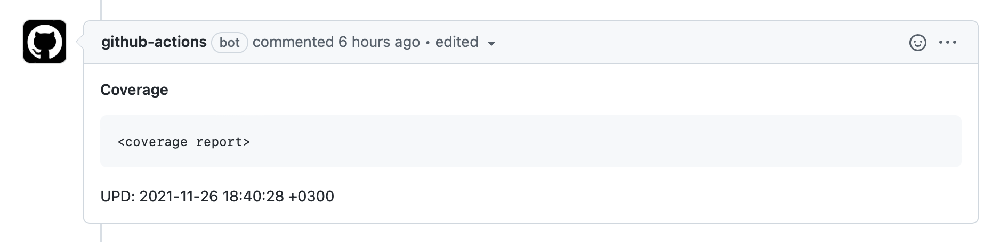

# Add or update comment GitHub Action

## Example

Write in your workflow:

```yml
upsert-comment:
  runs-on: ubuntu-latest
  steps:
    - uses: anna-money/action-comment@master
      with:
        timezone: 'Europe/Moscow'
        search_key: 'Coverage'
        text: |
          #### Coverage
          ```
          <coverage report>
          ```
```

Result:
